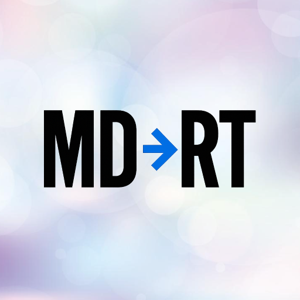

# MD→RT (Markdown to Rich Text)

[](https://www.apple.com/macos/)
[](https://www.python.org/)
[](#)
[](https://github.com/taazkareem/convert-md-to-rt/actions/workflows/publish.yml)
[](https://pypi.org/project/convert-md-to-rt/)
[](https://opensource.org/licenses/MIT)

**The easiest way to convert Markdown to Rich Text on macOS!**

MD→RT automatically converts Markdown in your clipboard to Rich Text formatting. Copy from anywhere, paste anywhere - it's that simple!

## 🎯 Overview

<div align="center">
<table>
<tr>
<td align="center" width="200">

</td>
<td align="left" width="400">

**Transform your workflow with instant Markdown-to-Rich Text conversion**

Perfect for developers, writers, and anyone who works with formatted text!

</td>
</tr>
</table>
</div>

<div align="center">


</div>

## ✨ Features

- **🚀 Zero Setup**: Install and run - no configuration needed
- **📱 Menubar Integration**: Runs quietly in your menu bar
- **🔄 Real-time Monitoring**: Watches your clipboard for Markdown content
- **🎯 Smart Detection**: Only converts actual Markdown, ignores plain text
- **💾 Preserves Original**: Keeps original text as fallback

## 🚀 Quick Start

**Option 1: PyPI Install (recommended):**
```bash
pipx run convert-md-to-rt
```

*Available logging levels: `--quiet`, `--verbose`, `--debug`*

**Option 2: From Source:**
```bash
git clone https://github.com/taazkareem/convert-md-to-rt.git && cd convert-md-to-rt && python3 -m src.md2rt.menubar
```

*Note: Source installation requires `rumps` to be installed separately: `pip install rumps`*

**How to use:**
- Copy any Markdown text (like `**bold**` or `# Heading`)
- Paste into rich text apps → you'll see formatting!
- Paste into plain text apps → you'll see original Markdown!
- Control via menu bar: Start/Stop/Quit

The app runs quietly in your menu bar and works automatically!

💡 **Pro Use Case**
- Copy LLM outputs directly into ClickUp task descriptions with formatting
- Easily send Apple Mail with checkmarked lists or code blocks
- Many more

## 🛠️ Development

### How It Works Under The Hood
MD→RT converts Markdown to Rich Text by:
1. **Detecting Markdown** in clipboard using regex patterns
2. **Converting to HTML** via external API and built-in parser
3. **Adding browser styling** for consistent formatting
4. **Placing styled HTML** in clipboard (preserving original Markdown)
5. **Rich Text apps** render the HTML as formatted text

*Note: End users see Rich Text, not HTML - the conversion is seamless.*

### Prerequisites
- Python 3.9+
- macOS (required for clipboard access)

### Setup
```bash
# Clone the repository
git clone https://github.com/taazkareem/convert-md-to-rt.git
cd convert-md-to-rt

# Create virtual environment
python3 -m venv .venv
source .venv/bin/activate

# Install dependencies
pip install -r requirements.txt

# Install development dependencies
pip install -e ".[dev]"
```

### Running Tests
```bash
pytest
```

### Project Structure
```
src/md2rt/
├── __init__.py
├── menubar.py          # Main menubar app (consolidated)
├── detector.py         # Markdown detection logic
├── converter.py        # Markdown to HTML conversion
├── clipboard.py        # Clipboard operations
└── runner.py           # Command-line runner
```

## 🤝 Contributing

This is an open-source project! Contributions are welcome:

1. Fork the repository
2. Create a feature branch
3. Make your changes
4. Add tests if applicable
5. Submit a pull request

## 🙏 Acknowledgments

- Conversion Powered by [Switchlabs](https://www.switchlabs.dev/)
- [ClickUp](https://clickup.com) One app to replace them all
